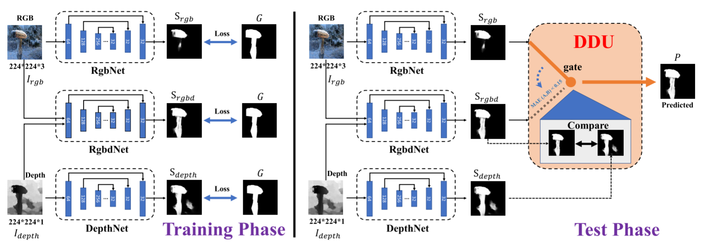
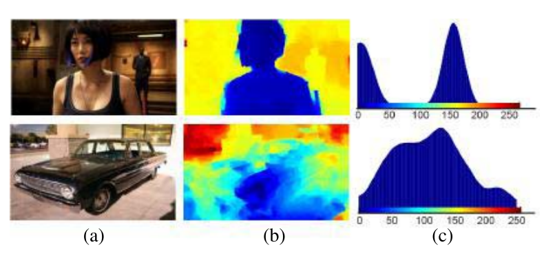
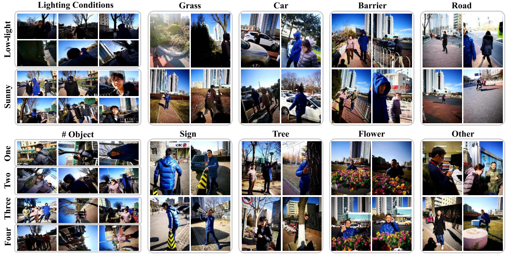
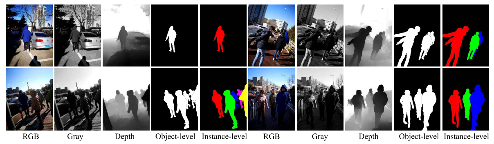
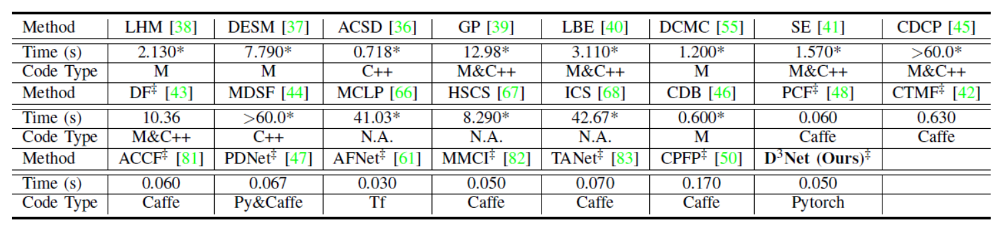
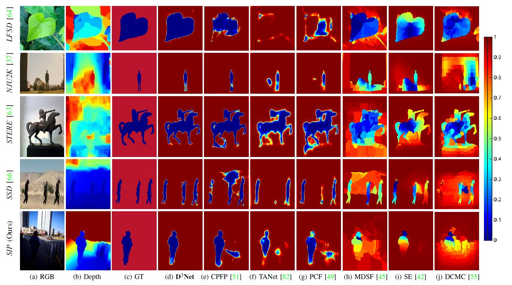

# RGB-D Salient Object Detection: Models, Data Sets, and Large-Scale Benchmarks (TNNLS2021) <a name="headin"></a>
Rethinking RGB-D Salient Object Detection: Models, Data Sets, and Large-Scale Benchmarks, IEEE TNNLS 2021. 

### :fire: NEWS :fire:
- [2022/06/09] :boom: Update the related works.
- [2020/08/02] : Release the training code.

<p align="center">
     <br/>
    <em> 
Figure 1: Illustration of the proposed D3Net. In the training stage (Left), the input RGB and depth images are processed with three parallel sub-networks, e.g., RgbNet, RgbdNet, and DepthNet. The three sub-networks are based on a same modified structure of Feature Pyramid Networks (FPN) (see § IV-A for details). We introduced these sub-networks to obtain three saliency maps (i.e., Srgb, Srgbd, and Sdepth) which considered both coarse and fine details of the input. In the test phase (Right), a novel depth depurator unit (DDU) (§ IV-B) is utilized for the first time in this work to explicitly discard (i.e., Srgbd) or keep (i.e., Srgbd) the saliency map introduced by the depth map. In the training/test phase, these components form a nested structure and are elaborately designed (e.g., gate connection in DDU) to automatically learn the salient object from the RGB image and Depth image jointly.
    </em>
</p>

### Table of Contents
- [RGB-D Salient Object Detection <a name="headin"></a>](#Title)
	- [Table of Contents](#table-of-contents)
	- [Abstract](#abstract)
	- [Notion of Depth Depurator Unit](#Notion-of-Depth-Depurator-Unit)
	- [Related Works](#related-works)
	- [SIP dataset](#SIP-dataset)
	- [Train](#train)
	- [Evaluation](#evaluation)
	- [Results](#results)
	- [Citation](#citation)

## Abstract
The use of RGB-D information for salient object detection has been explored in recent years. However, relatively few efforts have been spent in modeling salient object detection over real-world human activity scenes with RGB-D. In this work, we fill the gap by making the following contributions to RGB-D salient object detection. First, we carefully collect a new salient person (SIP) dataset, which consists of 1K high-resolution images that cover diverse real-world scenes from various viewpoints, poses, occlusion, illumination, and background. Second, we conduct a large-scale and so far the most comprehensive benchmark
comparing contemporary methods, which has long been missing in the area and can serve as a baseline for future research. We systematically summarized 31 popular models, evaluated 17 state-of-the-art methods over seven datasets with totally about 91K images. Third, we propose a simple baseline architecture, called Deep Depth-Depurator Network (D3Net). It consists of a depth depurator unit and a feature learning module, performing initial low-quality depth map filtering and cross-modal feature learning respectively. These components form a nested structure and are elaborately designed to be learned jointly. D3Net exceeds the performance of any prior contenders across five metrics considered, thus serves as a strong baseline to advance the research frontier. We also demonstrate that D3Net can be used to efficiently extract salient person masks from the real scenes, enabling effective background changed book cover application with 20 fps on a single GPU. All the saliency maps, our new SIP dataset, baseline model, and evaluation tools are made publicly available at https://github.com/DengPingFan/D3NetBenchmark.


## Notion of Depth Depurator Unit
The statistics of the depth maps in existing datasets (e.g., NJU2K, NLPR, RGBD135, STERE, and LFSD) suggest that — “high quality depth maps usually contain clear objects, but the elements in low-quality depth maps are cluttered (2nd row in Fig. 2)”

<p align="center">
     <br/>
    <em> 
    Figure 2: The smoothed histogram (c) of high-quality (1st row), lowquality (2nd row) depth map, respectively.
    </em>
</p>

## Related Works
Please refer to our recent survey paper: https://github.com/taozh2017/RGBD-SODsurvey

Paper with code: https://paperswithcode.com/task/rgb-d-salient-object-detection

## SIP dataset
<p align="center">
     <br/>
    <em> 
    Figure 3: Representative subsets in our SIP. The images in SIP are grouped into eight subsets according to background objects (i.e., grass, car, barrier, road,
sign, tree, flower, and other), different lighting conditions (i.e., low light and sunny with clear object boundary), and various number of objects (i.e., 1, 2, ≥3).
    </em>
</p>

<p align="center">
     <br/>
    <em> 
    Figure 4: Examples of images, depth maps and annotations (i.e., object level and instance level) in our SIP data set with different numbers of salient objects,
object sizes, object positions, scene complexities, and lighting conditions. Note that the “RGB” and “Gray” images are captured by two different monocular
cameras from short distances. Thus, the “Gray” images are slightly different from the grayscale images obtained from colorful (RGB) image. Our SIP data
set provides a new direction, such as depth estimating from “RGB” and “Gray” images, and instance-level RGB-D SOD.
    </em>
</p>

RGB-D SOD Datasets:  <a id="datasets" class="anchor" href="#datasets" aria-hidden="true"><span class="octicon octicon-link"></span></a>  
**No.** |**Dataset** | **Year** | **Pub.** |**Size** | **#Obj.** | **Types** | **Resolution** | **Download**
:-: | :-: | :-: | :-  | :-  | :-:| :-: | :-: | :-:
1   | [**STERE**]()   |2012 |CVPR   | 1000 | ~One       |Internet             | [251-1200] * [222-900] | [Baidu: rcql](https://pan.baidu.com/s/1CzBX7dHW9UNzhMC2Z02qTw)/[Google (1.29G)](https://drive.google.com/file/d/1JYfSHsKXC3GLaxcZcZSHkluMFGX0bJza/view?usp=sharing)
2   | [**GIT**](http://www.bmva.org/bmvc/2013/Papers/paper0112/abstract0112.pdf)  |2013 |BMVC   | 80   | Multiple  |Home environment     | 640 * 480 | [Baidu](https://pan.baidu.com/s/15sG1xx93oqWZAxAaVKu4lg)/[Google (35.6M)](https://drive.google.com/open?id=13zis--Pg9--bqNCjTOJGpCThbOly8Epa)
3   | [**DES**]()     |2014 |ICIMCS | 135  | One       |Indoor               | 640 * 480 | [Baidu: qhen](https://pan.baidu.com/s/1RRp8oV9FYMmPDU5sMXYH6g)/[Google (60.4M)](https://drive.google.com/open?id=15Th-xDeRjkcefS8eDYl-vSN967JVyjoR)
4   | [**NLPR**]()     |2014 |ECCV   | 1000 | Multiple  |Indoor/outdoor       | 640 * 480, 480 * 640 | [Baidu: n701](https://pan.baidu.com/s/1o9387dhf_J2sl-V_0NniFA)/[Google (546M)](https://drive.google.com/open?id=1CbgySAZxznbsN9uOG4pNDHwUPvQIQjCn)
5   | [**LFSD**]()     |2014 |CVPR   | 100  | One       |Indoor/outdoor       | 360 * 360 | [Baidu](https://pan.baidu.com/s/17EiZrnUc9vmx-zfVnP4iIQ)/[Google (32M)](https://drive.google.com/open?id=1cEeJpUukomdt_C4vUZlBlpc1UueuWWRU)
6   | [**NJUD**]()    |2014 |ICIP   | 1985 | ~One       |Moive/internet/photo | [231-1213] * [274-828] | [Baidu: zjmf](https://pan.baidu.com/s/156oDr-jJij01XAtkqngF7Q)/[Google (1.54G)](https://drive.google.com/open?id=1R1O2dWr6HqpTOiDn6hZxUWTesOSJteQo)
7   | [**SSD**]()      |2017 |ICCVW  | 80   | Multiple  |Movies               | 960 * 1080 | [Baidu: e4qz](https://pan.baidu.com/s/1Yp5gSdLQlhcJclSrbr-LeA)/[Google (119M)](https://drive.google.com/open?id=1k8_TQTZbbYOpnTvc9n6jgLg4Ih4xNhCj)
8   | [**DUT-RGBD**](https://openaccess.thecvf.com/content_ICCV_2019/papers/Piao_Depth-Induced_Multi-Scale_Recurrent_Attention_Network_for_Saliency_Detection_ICCV_2019_paper.pdf) |2019 |ICCV   | 1200 | Multiple  |Indoor/outdoor       | 400 * 600 | [Baidu: 6rt0](https://pan.baidu.com/s/1oMG7fWVAr1VUz75EcbyKVg)/[Google (100M)](https://drive.google.com/open?id=1DzkswvLo-3eYPtPoitWvFPJ8qd4EHPGv)
9   | [**SIP**]()     |2020 |TNNLS  | 929  | Multiple  |Person in wild       | 992 * 774 | [Baidu: 46w8](https://pan.baidu.com/s/1wMTDG8yhCNbioPwzq7t25w)/[Google (2.16G)](https://drive.google.com/open?id=1R91EEHzI1JwfqvQJLmyciAIWU-N8VR4A)
10  | Overall         |    |    |    |     |         |   | [Baidu: 39un](https://pan.baidu.com/s/1DgO18k2B32lAt0naY323PA)/[Google (5.33G)](https://drive.google.com/open?id=16kgnv9NxeiPGwNNx8WoZQLl4qL0qtBZN)

## Train
Put the three datasets 'NJU2K_TRAIN', 'NLPR_TRAIN','NJU2K_TEST' into the created folder "dataset".

Put the vgg-pretrained model 'vgg16_feat.pth' ( [GoogleDrive](https://drive.google.com/file/d/1SXOV-DKnnqFD_b9yxJCIzdSkU7qiHh1X/view?usp=sharing) | [BaiduYun](https://pan.baidu.com/s/17qaLM3nbgR_eGehSK-SOrA) code: zsxh )  into the created folder "model".
```
python train.py --net RgbNet
python train.py --net RgbdNet
python train.py --net DepthNet
```
# Requirement
- PyTorch>=0.4.1  
- Opencv   

# Pretrained models
-RgbdNet,RgbNet,DepthNet pretrained models can be downloaded from ( [GoogleDrive](https://drive.google.com/drive/folders/1jbZzUbgOC0XzbBEsy-Bgf3b-pvr62aWK?usp=sharing) | [BaiduYun](https://pan.baidu.com/s/1sgi0KExOv5KOfGQgXpDdqw) code: xf1h )  

# Training and Testing Sets
Our training dataset is:

https://drive.google.com/open?id=1osdm_PRnupIkM82hFbz9u0EKJC_arlQI

Our testing dataset is:

https://drive.google.com/open?id=1ABYxq0mL4lPq2F0paNJ7-5T9ST6XVHl1


## Evaluation
Put the three pretrained models into the created folder "eval/pretrained_model".
```
python eval.py
```

Toolbox (updated in 2022/06/09): 
[Baidu: i09j] (https://pan.baidu.com/s/1ArnPZ4OwP67NR71OWYjitg) 

[Google] (https://drive.google.com/file/d/1I4Z7rA3wefN7KeEQvkGA92u99uXS_aI_/view?usp=sharing)

<p align="center">
     <br/>
    <em> 
    Table1. Running time comparison.
    </em>
</p>

## Results
<p align="center">
     <br/>
</p>
Results of our model on seven benchmark datasets can be found: 

Baidu Pan(https://pan.baidu.com/s/13z0ZEptUfEU6hZ6yEEISuw) 提取码: r295

Google Drive(https://drive.google.com/drive/folders/1T46FyPzi3XjsB18i3HnLEqkYQWXVbCnK?usp=sharing)


## Citation
If you find this work or code is helpful in your research, please cite:
```
@article{fan2019rethinking,
  title={{Rethinking RGB-D salient object detection: Models, datasets, and large-scale benchmarks}},
  author={Fan, Deng-Ping and Lin, Zheng and Zhang, Zhao and Zhu, Menglong and Cheng, Ming-Ming},
  journal={IEEE TNNLS},
  year={2021}
}
@article{zhou2021rgbd,
  title={RGB-D Salient Object Detection: A Survey},
  author={Zhou, Tao and Fan, Deng-Ping and Cheng, Ming-Ming and Shen, Jianbing and Shao, Ling},
  journal={CVMJ},
  year={2021}
}
```
